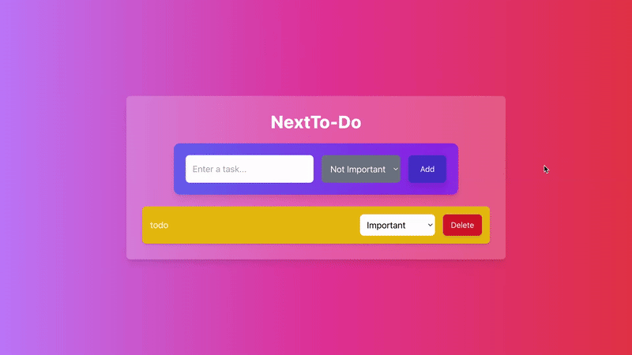

# NextTo-Do

A simple and stylish To-Do List application built with React, Tailwind CSS, and LocalStorage. This app allows users to add tasks, assign importance levels (Urgent, Important, Not Important), and store tasks in the browser's LocalStorage so they persist across page reloads.

## Features

- **Add Tasks**: Enter a task and add it to your list.
- **Importance Levels**: Assign tasks an importance level (Urgent, Important, Not Important).
- **Task Removal**: Delete tasks from your list.
- **Persistence**: Tasks are saved in LocalStorage, so they persist across page reloads.
- **Styled with Tailwind CSS**: Beautiful, responsive UI using Tailwind CSS.

## Demo

## Technologies Used

- **React**: JavaScript library for building user interfaces.
- **Tailwind CSS**: Utility-first CSS framework for fast styling.
- **LocalStorage**: Web API for storing data on the user's browser.

## How To Use

- **Add Task**: Type a task in the input field and select its importance level (Urgent, Important, or Not Important) using the dropdown.
- **Delete Task**: Click the "Delete" button next to a task to remove it from the list.
- **Persistence**: The tasks will remain stored in LocalStorage, so even if you refresh the page, your tasks will stay intact.

## License

This project is licensed under the MIT License - see the LICENSE file for details.

## Contact

Oscar Rendon

Code sourced with help ChatGPT

- github Link:https://github.com/Danr55/NextTo-Do
- Deployed Link:https://next-to-do-five.vercel.app/